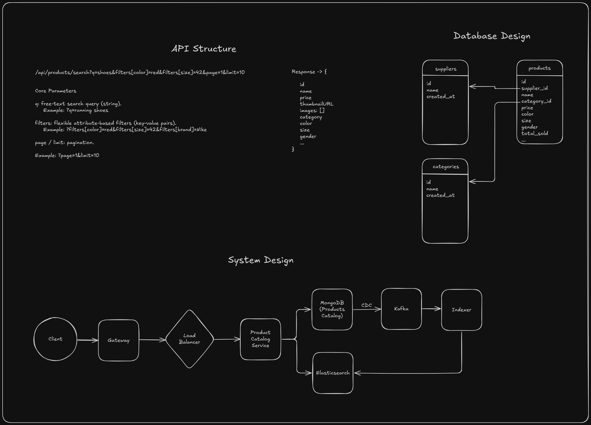

# 🛍️ Product Catalog Search API

A minimal **Product Catalog microservice** built with **Node.js**, **MongoDB**, and **Elasticsearch**.  
It supports **free-text search** and **attribute filters** (e.g. color, size, brand), with results ranked by sales popularity.

The project is **fully containerized** → run everything with one command, then test with a single `curl`.

---

## ✨ Features
- Store products with flexible attributes in **MongoDB**
- **Seed script** inserts sample products automatically
- **Sync to Elasticsearch** for fast free-text + filter queries
- **Search API**:  
  - free-text (`q`)  
  - filters (color, size, brand…)  
  - pagination (`page`, `limit`)  
- **Docker Compose** setup (API + MongoDB + Elasticsearch)
- System design documented with ERD + architecture diagram

---

## 🖼️ Architecture



**Flow:**
1. Data stored in MongoDB (source of truth)  
2. Products indexed in Elasticsearch for search  
3. API queries Elasticsearch for fast text + faceted search  
4. Results ranked by `total_sold` popularity field  

---

## 🚀 Quick Start

### 1. Clone the repo
```bash
git clone <your-repo-url>
cd product-catalog
```

### 2. Start Everything
```bash
docker-compose up --build
```

### 3. Test The API
```bash
curl "http://localhost:3000/products/search?q=shirt&color=red&size=S"
```

### Example Response
```
{
  "total": 1,
  "results": [
    {
      "id": "64f8e1...",
      "title": "T-Shirt",
      "brand": "Nike",
      "color": "red",
      "size": "S",
      "price": 19.99,
      "total_sold": 120
    }
  ]
}
```

## 📂 Project Structure

```
product-catalog/
├── docker-compose.yml
├── Dockerfile
├── README.md
├── src/
│   ├── config/         # DB & ES connection configs
│   │   ├── elastic.js
│   │   ├── env.js
│   │   └── mongo.js
│   ├── controller/     # Handles HTTP requests & responses
│   │   └── search.controller.js
│   ├── model/          # Defines data structure
│   │   └── product.model.js
│   ├── route/          # Defines API routes
│   │   └── index.js
│   ├── service/        # Business logic (DB + ES queries)
│   │   └── search.service.js
│   └── app.js          # Express app entrypoint
├── scripts/
│   ├── create-index.js   # Creates Elasticsearch index
│   ├── seed-products.js  # Seeds MongoDB with sample products
│   └── sync-to-es.js     # Syncs MongoDB to Elasticsearch
├── package.json
└── docker-entrypoint.sh
```

## 📌 Notes

- The diagram shows Kafka/CDC for large-scale setups. For simplicity, here we run a seed + sync script instead.
- The code focuses on the search API (not admin CRUD).
- Best-seller ranking is based on ```total_sold```, already included in the ES index.